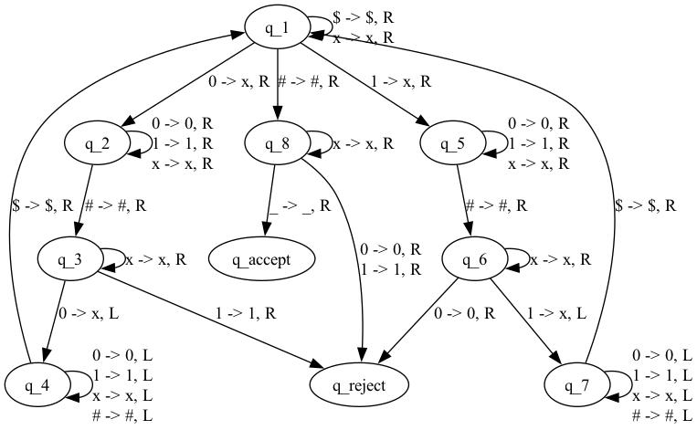

# One-Tape Turing Machine vs. Two-Tape Turing Machine

Contained here are implementations of two types of Turing Machines: the classic single-tape machine, and the two-tape variant, as well as visualizations, tests, and comparisons of the machines.

While equivalent in computational power, a two-tape Turing Machine can solve some problems far faster than a one-tape machine. One such problem is determining if two strings are identical: 
the design of the two-tape machine lends itself to this job, while a classic machine must use a more complicated algorithm, which costs efficiency. The efficiency gap is wide: O(n^2) and O(n) time 
complexities (where n is the length of one of the input strings) on exactly the same task. Fitting a quadratic regression to the one-tape outputs from `run_timing.py` yield time = 3n^2 + 5n + 3,
confirming the expectation that the one-tape machine would solve this problem in O(n^2) time.

# Usage

## Quick Start

run `./quick_run.sh` to see the outputs at each step for a comparison of a simple pair of strings. 

## main.py

run `python main.py` and answer the prompts to observe the outputs for custom strings. This program also provides an option to run a different one-tape Turing Machine algorithm which determines if the
input string has an equal number of 0's and 1's.

## run_timing.py

run `python run_timing.py` to run a time complexity experiment (the number of steps each machine takes, run on strings of increasing length) and save the resulting plot in a .png under assets.

## install graphviz (optional)

[Graphviz](https://graphviz.org/) is only necessary if you respond "yes" to the input request in `main.py` to plot the TM's state diagram. To install: 

On MacOS: `brew install graphviz`

# Why I made this

I wanted to understand why a two-tape TM could be faster than a single-tape machine. As someone who had never taken the time to understand a two-tape machine beyond "it has 2 tapes", programming
one was valuable. I was also very happy to see that my experiments confirmed the theoretical properties of the algorithms implemented, and designing/debugging the machines left me with a strong sense
of why those results are the way they are.

